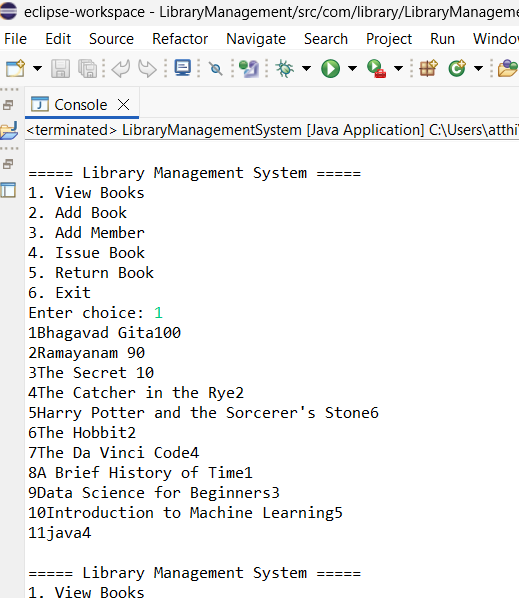

# 🌐 Personal Portfolio Website

## 🚀 Overview
This is my personal **portfolio website** developed to showcase my skills, projects, and contact information. The website is fully responsive and designed with a clean and modern user interface.

It highlights my work as a **Java Full Stack Developer** and provides quick access to my GitHub projects and resume.

---

## 🛠 Technologies Used
- HTML  
- CSS  
- Bootstrap  
- JavaScript  

---

## ✨ Features
- Responsive design (mobile-friendly)  
- Smooth scrolling navigation  
- Hero section with introduction  
- Skills section with hover effects  
- Projects section with GitHub links  
- Contact section with email, GitHub, and LinkedIn  
- Downloadable resume  

---

## 📂 Project Structure

portfolio/
│── index.html
│── style.css
│── image.png
│── HARINIATTHI(1).pdf
│── screenshots/
│ ├── screenshot.png
│ └── Screenshot2.png
  └── screenshots.png
│── js/
│ └── script.js
│── README.md

---

## ▶️ How to Run the Project

1. Clone the repository:

git clone https://github.com/aharini-codes/your-portfolio-repo.git

2. Open the folder  

3. Double-click `index.html`  
   or open using Live Server  

---

## 🌍 Live Demo
👉 https://your-username.github.io/

*(Add your GitHub Pages link here)*

---

## 🖼️ Screenshots

---

## 💡 Key Learnings
- Built a fully responsive website using Bootstrap  
- Improved UI/UX design skills  
- Learned to structure a professional portfolio  
- Implemented smooth navigation and interactive features  

---

## 🚀 Future Improvements
- Add animations for better user experience  
- Add dark mode toggle  
- Integrate contact form with backend  
- Add more real-world projects  

---

## 👩‍💻 Author
**Harini**  
- GitHub: https://github.com/aharini-codes  
- LinkedIn: www.linkedin.com/in/harini-a-344249384

---

## ⭐ Acknowledgment
This project was developed to showcase my skills and projects as a fresher and to create a strong online presence for job opportunities.
