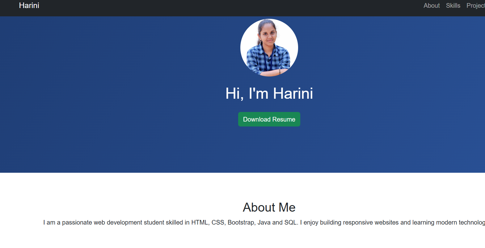

# 🌐 Personal Portfolio Website

Hi, I'm **A. Harini** 👋  
Aspiring **Java Full Stack Developer** passionate about building responsive and user-friendly web applications.

This portfolio website showcases my projects, technical skills, and journey in software development.

---

## 🚀 Features

- Responsive design (mobile-friendly)
- Clean and modern UI
- About Me section
- Projects showcase with descriptions
- Skills section
- Contact information
- Smooth navigation

---

## 🛠️ Technologies Used

- HTML5
- CSS3
- Bootstrap 5
- JavaScript

---

## 📁 Project Structure

---

## 🌐 Live Demo

👉 https://aharini-codes.github.io/portfolio-website/

---

## 📸 Screenshot

---

## 👩‍💻 About Me

I am a B.Sc Computer Science graduate and an aspiring Java Full Stack Developer. I have completed a Java Full Stack internship and developed multiple projects including an E-Commerce website, Weather Application, Fitness website, and Smart Expense Tracker.

I am passionate about building responsive applications and continuously improving my skills in both frontend and backend technologies.

---

## 💼 Projects

### 🛒 E-Commerce Website
- Built using HTML, CSS, Bootstrap, and JavaScript  
- Implemented product listing, search functionality, and cart system  
- Fully responsive design  

🔗 Live: https://aharini-codes.github.io/E-commerce-website/  
🔗 GitHub: https://github.com/aharini-codes/E-commerce-website  

---

## 🧠 Skills

- Java  
- HTML, CSS, Bootstrap  
- JavaScript  
- MySQL  
- Git & GitHub  

---

## 📬 Contact

- 📧 Email: harithaa2219@gmail.com  
- 🔗 LinkedIn: https://www.linkedin.com/in/harini-a-344249384  
- 💻 GitHub: https://github.com/aharini-codes  

---

## 📌 Future Improvements

- Add backend integration (Java + SQL)
- Improve UI/UX design
- Add more real-world projects
- Implement contact form functionality

---

## 👤 Author

**A. Harini**
